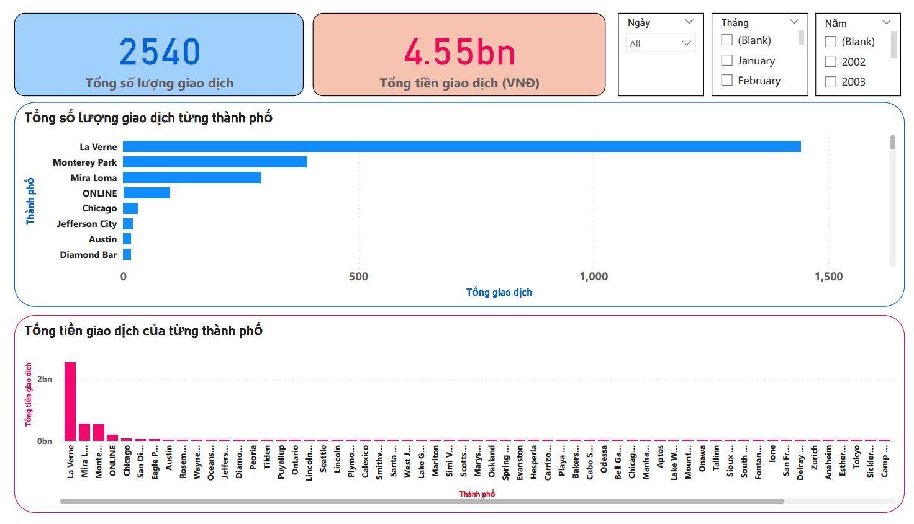

# Credit Card Transactions

## Overview
Công ty tài chính muốn xây dựng hệ thống quản lý dữ liệu giao dịch thẻ tín dụng từ các máy POS tại các cửa hàng và nhà hàng. Hệ thống sẽ xử lý dữ liệu thời gian thực, kiểm tra giao dịch có lỗi hay không. Nếu phát hiện lỗi, giao dịch sẽ không được chấp nhận. Giao dịch thành công sẽ được lưu trữ thông tin như Credit Card, ngày, thời gian, Merchant name, Merchant City, và số tiền chuyển đổi sang VNĐ. Cuối ngày, hệ thống sẽ tổng kết số lượng và giá trị giao dịch của từng merchant theo ngày, tháng và năm, và trực quan hóa thông tin này.

Giả định rằng giao dịch được phát sinh mỗi khi người dùng dùng credit card quẹt trên các máy POS tại các cửa hàng mua sắm, nhà hàng,…. Mỗi giao dịch này được gửi qua hệ thống theo thời gian thực. 

1. Sử dụng Kafka để mô phỏng từng giao dịch được phát sinh với các thông tin được cho trước dạng csv.
Kafka sẽ đọc từng dòng csv và gửi qua topic được định nghĩa trước để giả lập một giao dịch được
phát sinh từ máy POS.

2. Sử dụng Spark Streaming để đọc dữ liệu từ Kafka theo thời gian thực, các xử lý bao gồm lọc dữ liệu, biến đổi thông tin, tính toán dữ liệu.

3. Sử dụng Hadoop để lưu trữ các thông tin được xử lý từ Spark và là nơi lưu trữ thông tin
được xử lý để có thể trực quan hóa dữ liệu và thống kê.

4. Sử dụng Power BI để đọc dữ liệu từ Hadoop (dạng csv), thống kê dữ liệu và hiển thị dữ liệu một cách trực quan. 

## Getting started

## Result

